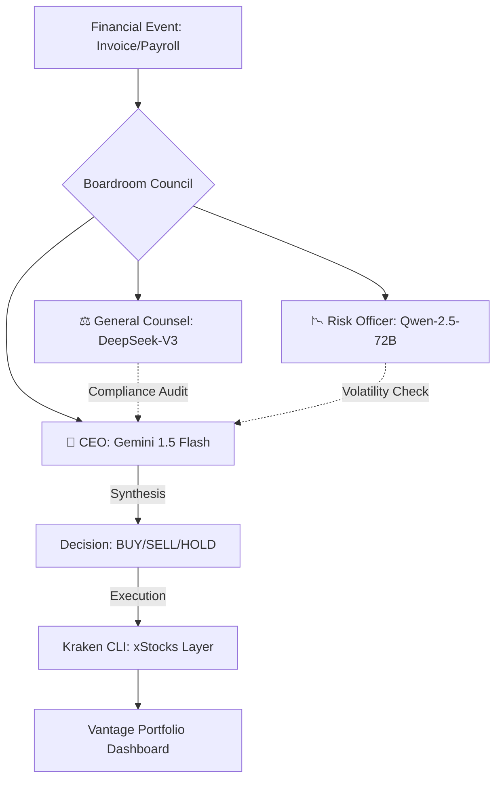

# 🌌 Vantage-Point 2.0: Autonomous Enterprise Treasury

**Vantage-Point 2.0** is an AI-native autonomous treasury engine built for the **Vultr x Gemini Hackathon**. It solves the "$1.2 Trillion SMB Cash Drag" by transforming idle corporate capital into yield-bearing assets through an agentic boardroom orchestration.

---

## 🏛 The Multi-Agent Architecture

Vantage-Point uses a **"Council of Experts"** approach to financial decision-making, ensuring every trade is audited for risk and compliance before execution.



### 🧠 Open-Source LLM Integration (via Featherless)

To meet the challenge of "realistic future-of-work use cases," we leverage specialized open-source models:

- **DeepSeek-V3**: Powers the **General Counsel** for strict logical auditing and compliance verification.
- **Qwen-2.5-72B**: Powers the **Macro Strategist**, providing deep contextual reasoning on market volatility.

---

## 🏆 Vultr Hackathon Specializations

### ☁️ Vultr-Native Deployment

- **Containerized Excellence**: The entire stack (Backend, Frontend, MongoDB) is containerized for seamless deployment to **Vultr Cloud Compute** instances.
- **Performance Optimized**: Leverages Vultr's high-speed CPU performance to run the **Kraken CLI** natively inside the backend container.

### 🐙 Kraken xStocks Integration

Vantage-Point is built specifically for the **Kraken CLI**, enabling autonomous trading of tokenized U.S. equities (xStocks) directly from a corporate treasury dashboard.

### 🎭 Multimodal Ingestion

Ingests real-world enterprise documents (Invoices, Tax Forms) using **Gemini 1.5 Flash**, converting static liabilities into active "Float Events."

---

## ✨ Key Features

- **📜 Glass-Box Reasoning**: A "SOX-ready" audit trail for every AI decision.
- **📈 Equinox Score**: Real-time treasury efficiency metric.
- **🛡️ Defensive Failover**: Resilient architecture with 120s timeouts for complex reasoning.
- **🎨 Premium Aesthetics**: A state-of-the-art glassmorphism UI designed for executive oversight.

---

## 🛠 Tech Stack

- **AI**: Gemini 1.5 Flash, DeepSeek-V3, Qwen-2.5-72B.
- **Backend**: FastAPI, MongoDB, Kraken CLI v0.3.2.
- **Frontend**: React (Vite), TypeScript, Nginx.
- **Infrastructure**: Docker, Docker Compose, Vultr Cloud.

---

## 🚀 Deployment (Vultr)

### 1-Line Provisioning

On a fresh Vultr Ubuntu instance:

```bash
curl -sSL https://raw.githubusercontent.com/rasali535/vantage_point/main/vultr-init.sh | sudo bash
```

### Manual Setup

1. **Clone**: `git clone https://github.com/rasali535/vantage_point.git`
2. **Configure**: Fill in `.env` with API keys.
3. **Launch**: `docker-compose up --build -d`

---

Built with precision by **Antigravity** for the **Vultr x Gemini Hackathon**.
